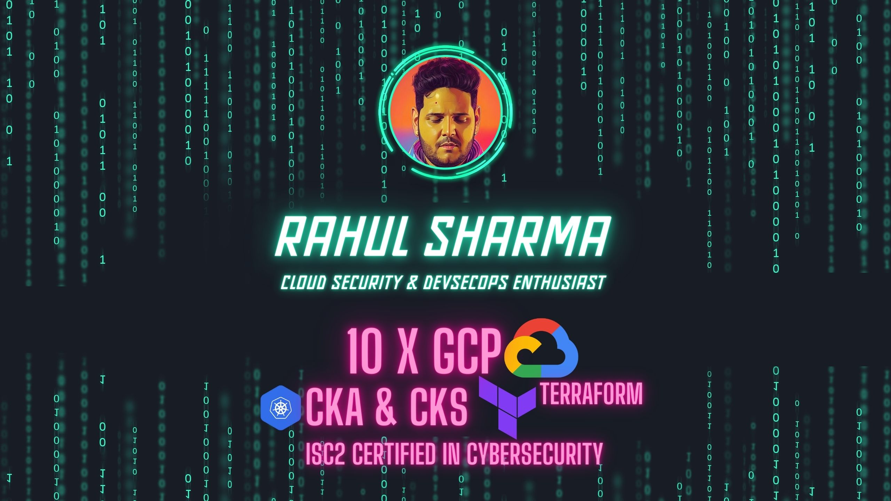

<h2 align='center'> Sr Cloud Security Consultant (GCP) / DevSecOps Enthusiast </h2>

<h4 align='center'>Profile <a href="https://rvsharma.com">https://rvsharma.com</h4>

&nbsp;&nbsp;
&nbsp;&nbsp;
&nbsp;&nbsp;
&nbsp;&nbsp;
&nbsp;&nbsp;
&nbsp;&nbsp;

### My Digital Garden 🌱

I write blog posts, most of which you will find on my [Medium](https://medium.com/@rahulvinodsharma/) or visit my profile at [rvsharma.com](https://rvsharma.com).

<h3 align='left'> Professional Summary </h3>

- With over seven years of experience in the I.T. industry, I have a diverse background in networking, DevOps, cloud, and cyber security. Exceptionally skilled in using Google Cloud Platform and its security features, and have hands-on experience in automating various aspects of I.T. operations, including configuration management, security, build/release management, cloud resource utilization, and infrastructure automation. A team player and thrive in collaborative environments where I can contribute my expertise to help drive success for the organization.
- Worked with Compliance Like PCI-DSS, HIPAA, N.I.S.T., and C.I.S. Frameworks.
- Experiences with industry-leading tools and models like C.S.P.M., S.I.E.M., C.N.A.P.P., C.W.P.P., and Zero trust.
- Experience in designing, implementing, and maintaining secure cloud-based systems and environments.
- Strong communication skills and ability to collaborate with cross-functional teams to ensure the security of an organization's cloud-based systems and data.
- Highly motivated individual always looking to learn and improve my skills. Passion for open source tools and enjoy maintaining a home lab to experiment with new technologies and techniques. A fast learner and thrive in dynamic environments where I can take on new challenges and learn new skills. In addition, I Believe in giving back to the community and am committed to sharing my knowledge and expertise with others.

---

#### PROFESSIONAL CERTIFICATES

- **Google LLC.**

  - [Professional Cloud DevOps Engineer.](https://www.credential.net/8e694924-8a4c-4845-b9a6-0ecf820d8988) - Oct 2022
  - [Cloud Digital Leader.](https://www.credential.net/e9290eea-49ac-4909-8616-b2a90a6ccdf5) - Oct 2022
  - [Professional Cloud Developer.](https://www.credential.net/9fa81d1e-a058-44fa-be5f-0f91d2866615) - Oct 2022
  - [Professional Cloud Database Engineer.](https://www.credential.net/36907547-5753-4767-ac05-4a40a7458f63) - Oct 2022
  - [Professional Cloud Network Engineer.](https://www.credential.net/58e7e514-a2e6-47c3-b40e-298c2f6a4811) - Oct 2022
  - [Professional Cloud Architect.](https://www.credential.net/d85d5501-5a69-4111-8508-9d24bb6cf2d0) - Aug 2022
  - [Associate Cloud Engineer.](https://www.credential.net/7808da12-2b20-4821-8d63-d09910b35807) - Jan 2022
  - [Professional Cloud Security Engineer.](https://www.credential.net/9220bffb-2340-41df-8316-413340863802) - Aug 2021
  
-  **ISC2**
  - Certified in CloudSecurity - Jun 2024

- **HashiCorp**
  - [Terraform Associate - 2021 Mar](https://www.credly.com/badges/443ab208-b305-48f2-b0ce-4fd50df5faf8/public_url)
- **Cloud-Native Computing Foundation**
  - [Certified Kubernetes Administrator (CKA) - 2020 Nov](https://www.credly.com/badges/8d8a8c96-3361-4fe0-a09d-d98c3ce77e73/public_url)
  - [Certified Kubernetes Administrator (CKA) - 2023 May](https://www.credly.com/badges/600e2563-5db7-481f-9d3a-6674863f3c3c/public_url)

- **Cisco Systems**
  - 200-125 CCNA Routing and Switching - 2018 Sep

---

#### CAREER PROFILE

**Sr. Cloud Security Consultant**, 66Degress, **Jan / 2022 - Present**, Mysuru, IN
**Project**: Davita Inc (HealthCare)
**Cloud**: Google Cloud Platform

- Implemented C.S.P.M., C.I.E.M. and C.W.P.P. using wiz.io

- Implemented Container vulnerability scanning in Gitlab CI along the organization.

- Conducting security assessments and audits to identify potential vulnerabilities and risks in the company's cloud environment.

- Monitoring the company's cloud environment for security incidents and breaches and responding to such incidents promptly and effectively.

- Staying up-to-date with industry best practices and emerging security threats and implementing appropriate measures to mitigate those threats.

- Providing guidance and training to other team members on security best practices and procedures.

- Participating in incident response planning and exercises ensures that the company is prepared to handle security incidents.

  **Tools Used**: GCP, Gitlab, Docker, Kubernetes C.S.P.M., C.I.E.M., C.W.P.P., C.N.A.P.P., Bash, Python.

**Sr. DevSecOps Engineer**, CloudCover Consultancy Pvt Ltd, **F.E.B. / 2021 - Jan 2022**, Pune, IN
**Project**: O.V.O. Payments (PT Visionet Internasional)
**Cloud**: Google Cloud Platform

- Designing & Implementing Manifests for hardening Multiple Clouds with Different Compliances like PCI, SOC/2, HIPAA, C.I.S., ISO, and N.I.S.T.

- Implementing Threat alerting systems with tools such as GCP Audit logs and Cloudtrail. Worked with S.I.E.M., C.S.P.M., and C.W.P.P.

- Staying up-to-date with industry best practices and emerging security threats and implementing appropriate measures to mitigate those threats.

- Providing guidance and training to other team members on security best practices and procedures.

- Participating in incident response planning and exercises ensures that the company is prepared to handle security incidents.

- Designing and implementing security controls and policies to protect the company's cloud-based assets and data.

- Conducting security assessments and audits to identify potential vulnerabilities and risks in the company's cloud environment.

- Implementing and maintaining security tools and technologies, such as firewalls, intrusion detection and prevention systems, and encryption technologies.

  **Tools Used**: GCP, Gitlab, Docker, Kubernetes C.S.P.M., C.I.E.M., C.W.P.P., S.I.E.M., Snyk, Cloud Custodian, Bash Python.

**DevOps Engineer**, Functionize Inc., **Nov / 2017 - Feb/2021**,Noida, IN
**Project**: U.I. Test Automation On Cloud (Product Based)
**Cloud**: Google Cloud Platform

- Worked on GCP as Lead Ops Engineer.

- Migrated 3-tier application From on-premises to GCP occupying more than USD 50K GCP resources per month.

- Designing and implementing cloud-based solutions that meet the organization's business needs and objectives, using tools such as Terraform to automate the infrastructure provisioning process.

- Monitoring the organization's cloud-based systems and applications to ensure they run smoothly and efficiently.

- Collaborating with developers, architects, and other stakeholders to ensure that the organization's software delivery process is efficient and effective.

- Collaborating with development teams to ensure that applications and systems are designed and implemented with security in mind.

  **Tools Used**: GCP, Docker, Kubernetes, Monitoring, Pagerduty, Ansible, Terraform, Bash, Python. Bitbucket CI/CD, Jenkins, Spinnaker, apache, Nginx etc.

**Network Administrator**, CMI PVT. LTD., **AUG.** **/ 2015 - OCT / 2017** _-_ Delhi, IN

- Installing and configuring Linux operating systems, including installing software and drivers and configuring system settings and parameters.

- Managing user accounts, permissions, and security settings on Linux systems.

- Monitoring and troubleshooting system performance issues, such as high CPU or memory usage, and identifying and resolving problems.

- Managing and backing up data on Linux systems, including setting up and configuring backup schedules and procedures.

- Setting up and maintaining network connections, including configuring firewalls, routers, and switches.

- Ensuring network security by implementing and maintaining security measures, such as firewalls and intrusion detection systems.

  **Tools Used**: Linux Ubuntu, R.H.E.L., Git, Zabbix, Nagios, Bash, Python, Apache, Nginx, etc.

**Junior Penetration Tester**, Sandrock eSecurities Pvt. Ltd., **Jan / 2015 - July / 2015** _-_ Delhi, IN

- Using tools such as Kali Linux and the Open Web Application Security Project (O.W.A.S.P.) framework to identify vulnerabilities in web applications.

- Conducting manual and automated testing of web applications to identify security issues, including testing for vulnerabilities such as SQL injection, cross-site scripting (XSS), and cross-site request forgery (C.S.R.F.).

- Analyzing the results of penetration testing and presenting findings to clients or management, including recommendations for remediation.

- Collaborating with development teams to help them understand and address identified vulnerabilities.

- Staying up-to-date with industry best practices and emerging threats in the field of web application security.

- Conduct periodic web application reassessments to ensure that vulnerabilities have been adequately addressed and new vulnerabilities have not been introduced.

  **Tools Used**: Linux KaliLinux, Owasp top 10, Arachni and w3af scanner, Bash, Python.

---

#### EDUCATION

- 2011 - 2012 Secondary Education, New Oxford Public School, C.B.S.E
  - CGPA: 7.2
- 2012 - 2013 Senior Secondary Education, Jamia Urdu Aligarh
  - Percentage: 69.13%
- 2014 - 2017 Bachelors of Computer Applications, Jaipur National University
  - Percentage 70%
- 2017 - 2019 Masters of Computer Applications, Jaipur National University
  - Percentage 66.4%
